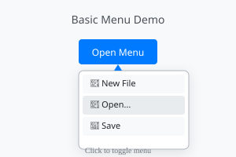
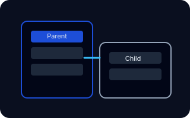
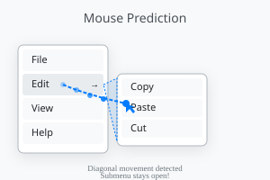

# @workspace/menu-vue

> Vue's most advanced headless menu system — instant accessibility, diagonal mouse prediction, and zero lock-in.

<table>
  <tr>
    <td width="33%" align="center"><br/><strong>Baseline dropdown</strong></td>
    <td width="33%" align="center"><br/><strong>Infinite submenus</strong></td>
    <td width="33%" align="center"><br/><strong>Diagonal intent</strong></td>
  </tr>
</table>

```vue
<script setup lang="ts">
import { UiMenu, UiMenuTrigger, UiMenuContent, UiMenuItem } from '@workspace/menu-vue'
const actions = ['Edit', 'Duplicate', 'Archive']
</script>

<template>
  <UiMenu>
    <UiMenuTrigger>Actions</UiMenuTrigger>
    <UiMenuContent>
      <UiMenuItem v-for="action in actions" :key="action" @select="() => console.log(action)">
        {{ action }}
      </UiMenuItem>
    </UiMenuContent>
  </UiMenu>
</template>
```

```bash
npm install @workspace/menu-vue
```

## Core Features

- Headless Vue 3 components powered by `@workspace/menu-core`
- WAI-ARIA compliant keyboard and pointer handling out of the box
- Smart mouse prediction keeps submenus open during diagonal travel
- Unlimited submenu depth with shared tree state and focus safety
- `asChild` pattern lets you keep native elements and design systems
- Built-in context menu + click menu support with unified API
- Auto positioning and viewport collision handling without extra deps
- Snapshot-driven state subscriptions for zero wasted renders
- Programmatic controller for imperative open/close/highlight flows
- CSS variable theme surface for light/dark/brand combos
- First-class TypeScript types for every prop, event, and controller method
- Works with virtualization strategies for 1000+ items

Docs → [./docs/index.md](./docs/index.md)

## Why this library exists

- **HeadlessUI** couples logic to Tailwind-era assumptions, lacks mouse prediction, and breaks under deep submenu trees.
- **Radix Vue** mirrors React APIs but still ties you to their opinionated slot structure and no framework-agnostic core.
- **Naive UI** ships batteries-included menus, but styling + behavior are inseparable, making custom UX nearly impossible.
- Designers demanded diagonal hover intent, perf on 1000-row tables, and context menus that feel native — so we built it.

## Highlights of architecture

- Shared observable menu tree keeps open/active paths in sync across levels.
- Pointer heuristics run outside Vue render cycle for predictable 60fps intent detection.
- Adapter layer returns ready-to-spread props so DOM stays under your control.
- Controller API exposes `open/close/highlight/select` hooks for automation.
- Positioner computes anchor/panel geometry with gutter + viewport padding inputs.
- `asChild` cloning ensures ARIA + event wiring survive custom elements.
- Core is framework-agnostic, so Menu Vue stays tiny and future-proof.

## Feature Comparison Table

| Feature | @workspace/menu-vue | Headless UI | Radix Vue | Naive UI |
|---------|---------------------|-------------|-----------|----------|
| Smart mouse prediction | ✅ | ❌ | ❌ | ❌ |
| Unlimited nested submenus | ✅ | ❌ | ✅ | ✅ |
| Auto positioning | ✅ | ❌ | ✅ | ✅ |
| `asChild` pattern | ✅ | ✅ | ✅ | ❌ |
| Framework-agnostic core | ✅ | ❌ | ❌ | ❌ |
| Context + click menus | ✅ | ⚠️ limited | ✅ | ✅ |
| Programmatic controller | ✅ | ❌ | ✅ | ⚠️ limited |
| Bundle size (min+gzip) | ~8 KB | ~12 KB | ~15 KB | ~45 KB |
| Virtualization ready | ✅ | ❌ | ⚠️ manual | ⚠️ manual |
| TypeScript coverage | 100% | partial | 100% | partial |

## Getting Started

1. `npm install @workspace/menu-vue`
2. Wrap your trigger + content with `<UiMenu>` / `<UiMenuTrigger>` / `<UiMenuContent>`
3. Spread controller props onto your DOM via `asChild` when customizing
4. Add nested `<UiSubMenu>` components for multi-level trees (level 3+ supported)
5. Dive deeper in [docs/getting-started.md](./docs/getting-started.md)

## FAQ

- **Does it work with Nuxt / SSR?** Yes. Components render on the server and hydrate with zero config.
- **Can I disable mouse prediction?** Pass `:options="{ mousePrediction: null }"` on `UiMenu`.
- **How do I run context menus?** Use `trigger="contextmenu"` or open the controller at pointer coordinates (see `guide/context-menu.md`).
- **What about huge data sets?** Pair `<UiMenuContent>` with `vue-virtual-scroller` (recipe in `guide/virtualization.md`).

## Browser Support

- Evergreen Chromium, Firefox, Safari (ES2020+)
- Vue 3.4+
- TypeScript 5+

## License

MIT © Workspace OSS
